# Resultados dos Testes Funcionais da rota `/movies`

Este documento agrupa os resultados dos testes funcionais realizados na API Cinema. A seguir, você encontrará a descrição dos cenários de testes e seus respectivos resultados.

A API foi testada utilizando diferentes cenários para garantir a conformidade com os requisitos especificados.

### Cobertura de Testes

Nessa Sprint a cobertura de testes Funcionais foi de aproximadamente 83,33%.

<h3>Casos de Teste</h3>

- [Cadastro de Filme](#cadastro-de-filme)
- [Listagem de Filmes](#listagem-de-filmes)
- [Busca de Filme](#busca-de-filme)
- [Deleção de Filme](#deleção-de-filme)
- [Edição de Filme](#edição-de-filme)

 

## Cadastro de Filme

### CT01 - Cadastro de filme com dados válidos

#### Descrição
Cadastrar um filme fornecendo todos os dados necessários e válidos.

**Nível de Autorização:** Administrador\
**Método:** POST\
**Tipo:** Positivo\
**Código esperado:** 201

### Resultado

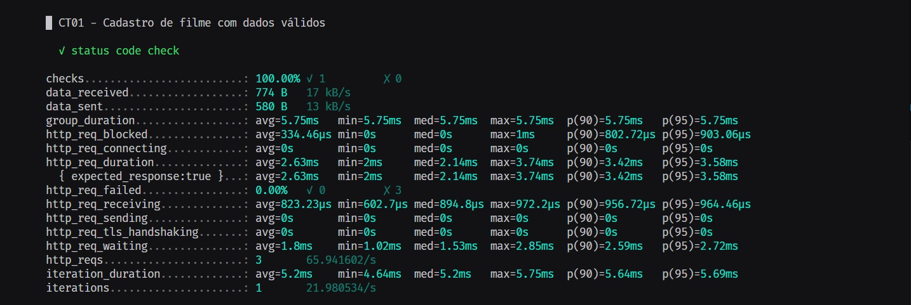

---

### CT02 - Cadastro de mais de um filme com o mesmo nome

#### Descrição
Tentar cadastrar dois filmes com o mesmo nome.

**Nível de Autorização:** Administrador\
**Método:** POST\
**Tipo:** Funcional\
**Código esperado:** 400

### Resultado

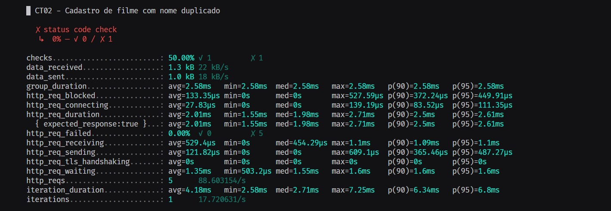

---

### CT03 - Cadastro de filme com dados faltando

#### Descrição
Tentar cadastrar um filme sem fornecer todos os dados necessários.

**Nível de Autorização:** Administrador\
**Método:** POST\
**Tipo:** Negativo\
**Código esperado:** 400

### Resultado

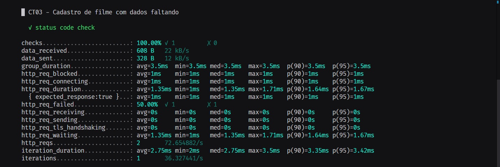

---

### CT03 - Cadastro de filme com dados faltando

#### Descrição
Tentar cadastrar um filme sem fornecer todos os dados necessários.

**Nível de Autorização:** Administrador\
**Método:** POST\
**Tipo:** Negativo\
**Código esperado:** 400

### Resultado

---

## Listagem de Filmes

### CT06 - Listar filmes cadastrados no sistema

#### Descrição
Listar todos os filmes que foram cadastrados no sistema.

**Nível de Autorização:** Comum\
**Método:** GET\
**Tipo:** Positivo\
**Código esperado:** 200

### Resultado

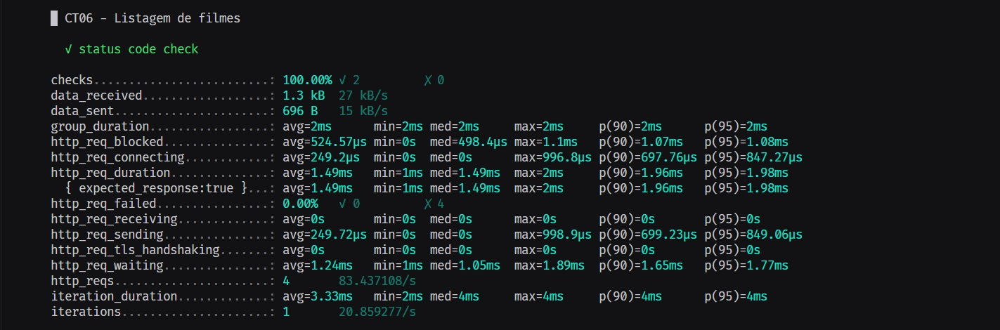

---

## Busca de Filme

### CT07 - Busca de filme com id válido

#### Descrição
Buscar um filme no sistema utilizando um id válido.

**Nível de Autorização:** Comum\
**Método:** GET\
**Tipo:** Positivo\
**Código esperado:** 200

### Resultado

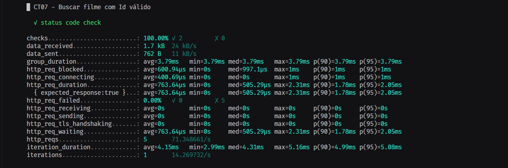

---

### CT08 - Busca de filme com id inválido

#### Descrição
Tentar buscar um filme utilizando um id que não existe.

**Nível de Autorização:** Comum\
**Método:** GET\
**Tipo:** Negativo\
**Código esperado:** 400

### Resultado

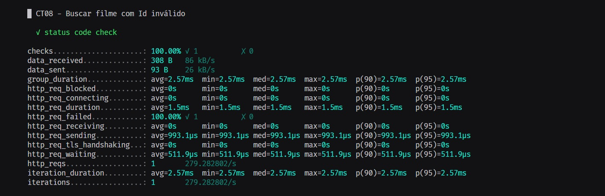

---

## Deleção de Filme

### CT10 - Excluir filme com id válido

#### Descrição
Excluir um filme do sistema utilizando um id válido.

**Nível de Autorização:** Administrador\
**Método:** DELETE\
**Tipo:** Positivo\
**Código esperado:** 200

### Resultado

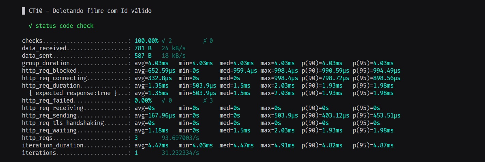

---

## Edição de Filme

### CT14 - Editar uma informação do filme com id válido

#### Descrição
Editar uma informação de um filme utilizando um id válido.

**Nível de Autorização:** Administrador\
**Método:** PUT\
**Tipo:** Positivo\
**Código esperado:** 200

### Resultado

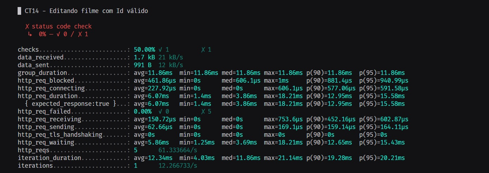

---

### CT15 - Editar uma informação do filme com id inválido

#### Descrição
Tentar editar uma informação de um filme utilizando um id que não existe.

**Nível de Autorização:** Administrador\
**Método:** PUT\
**Tipo:** Negativo\
**Código esperado:** 404

### Resultado

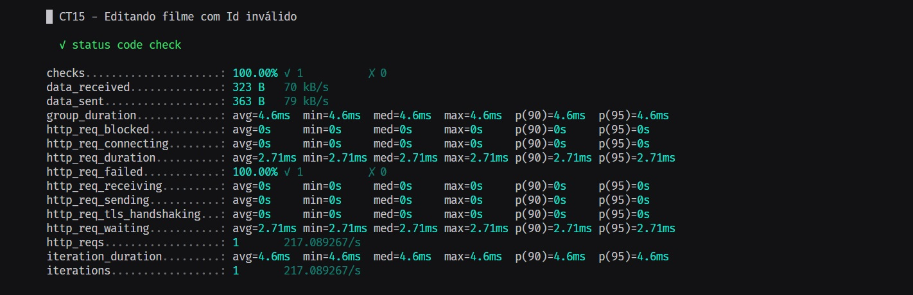

---

### CT17 - Editar nome do filme com id válido, utilizando nome já utilizado

#### Descrição
Tentar editar o nome de um filme para um nome que já existe no sistema.

**Nível de Autorização:** Administrador\
**Método:** PUT\
**Tipo:** Funcional\
**Código esperado:** 400

### Resultado

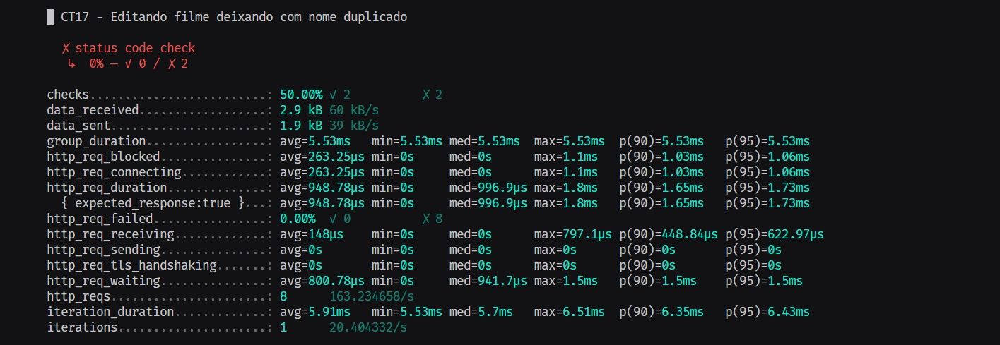

---

### CT18 - Editar removendo um item do filme e deixando-o vazio

#### Descrição
Tentar editar um filme removendo um item obrigatório e deixando-o vazio.

**Nível de Autorização:** Administrador\
**Método:** PUT\
**Tipo:** Negativo\
**Código esperado:** 400

### Resultado

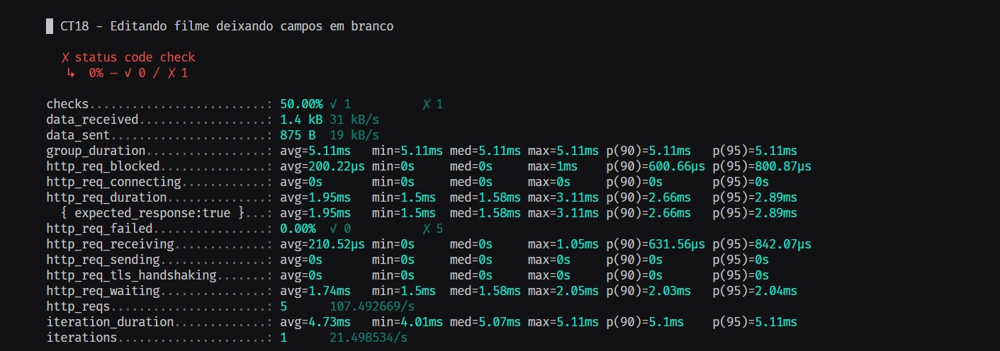