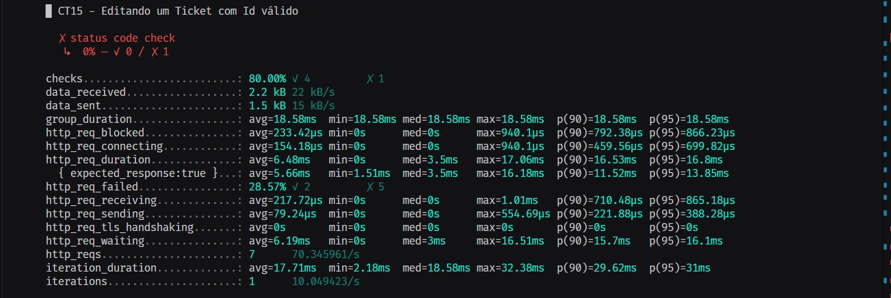

# Resultados dos Testes Funcionais da rota `/tickets`

Este documento agrupa os resultados dos testes funcionais realizados na API Cinema. A seguir, você encontrará a descrição dos cenários de testes e seus respectivos resultados.

A API foi testada utilizando diferentes cenários para garantir a conformidade com os requisitos especificados.

### Cobertura de Testes

Nessa Sprint, a cobertura de testes Funcionais foi de aproximadamente 61,1%.

- A cobertura limitada de testes deve-se, em grande parte, a problemas técnicos encontrados na API. Verificou-se que ao realizar chamadas HTTP com o atributo ID de um ticket (`tickets/{id}`), a API apresenta falhas críticas, resultando na indisponibilidade do sistema. Esse bug impediu a execução completa dos testes nas rotas que envolvem operações de leitura, atualização, e exclusão de tickets, afetando diretamente a qualidade da cobertura de testes planejada.

<h3>Casos de Teste</h3>

- [Cadastro de Ingresso](#cadastro-de-ingresso)
- [Listagem de Ingressos](#listagem-de-ingressos)
- [Busca de Ingresso](#busca-de-ingresso)
- [Deleção de Ingresso](#deleção-de-ingresso)
- [Edição de Ingresso](#edição-de-ingresso)

 

## Cadastro de Ingresso

### CT01 - Cadastro de ingresso com dados válidos

#### Descrição

Cadastrar um ingresso fornecendo todos os dados necessários e válidos.

**Método:** POST\
**Tipo:** Positivo\
**Código esperado:** 201

### Resultado

---

### CT02 - Cadastro de ingresso com assento fora do intervalo permitido

#### Descrição

Tentar cadastrar um ingresso com o número do assento fora do intervalo permitido.

**Método:** POST\
**Tipo:** Negativo\
**Código esperado:** 400

### Resultado

---

### CT03 - Cadastro de ingresso com preço fora do intervalo permitido

#### Descrição

Tentar cadastrar um ingresso com o preço fora do intervalo permitido.

**Método:** POST\
**Tipo:** Negativo\
**Código esperado:** 400

### Resultado

---

### CT04 - Cadastro de mais de um ingresso com o mesmo assento

#### Descrição

Tentar cadastrar dois ingressos para o mesmo assento.

**Método:** POST\
**Tipo:** Funcional\
**Código esperado:** 400

### Resultado

---

### CT05 - Cadastro de ingresso com dados faltando

#### Descrição

Tentar cadastrar um ingresso sem fornecer todos os dados necessários.

**Método:** POST\
**Tipo:** Negativo\
**Código esperado:** 400

### Resultado

---

### CT06 - Cadastro de ingresso com dados inválidos

#### Descrição

Tentar cadastrar um ingresso fornecendo dados inválidos.

**Método:** POST\
**Tipo:** Negativo\
**Código esperado:** 400

### Resultado

---

### CT07 - Cadastro de ingresso com filme inválido

#### Descrição

Tentar cadastrar um ingresso com um filme que não existe no sistema.

**Método:** POST\
**Tipo:** Negativo\
**Código esperado:** 400

### Resultado

---

## Listagem de Ingressos

### CT08 - Listar ingressos cadastrados no sistema

#### Descrição

Listar todos os ingressos que foram cadastrados no sistema.

**Método:** GET\
**Tipo:** Positivo\
**Código esperado:** 200

### Resultado

---

## Busca de Ingresso

### CT09 - Busca de ingresso com id válido

#### Descrição

Buscar um ingresso no sistema utilizando um id válido.

**Método:** GET\
**Tipo:** Positivo\
**Código esperado:** 200

### Resultado

---

## Deleção de Ingresso

### CT13 - Excluir ingresso com id válido

#### Descrição

Excluir um ingresso do sistema utilizando um id válido.

**Método:** DELETE\
**Tipo:** Positivo\
**Código esperado:** 200

### Resultado

---

## Edição de Ingresso

### CT15 - Editar uma informação do ingresso com id válido

#### Descrição

Editar uma informação de um ingresso utilizando um id válido.

**Método:** PUT\
**Tipo:** Positivo\
**Código esperado:** 200

### Resultado

---

### CT19 - Editar removendo um item do ingresso e deixando-o vazio

#### Descrição

Tentar editar um ingresso removendo um item obrigatório e deixando-o vazio.

**Método:** PUT\
**Tipo:** Negativo\
**Código esperado:** 400

### Resultado

---

### CT20 - Editar uma informação do ingresso com id inválido

#### Descrição

Tentar editar uma informação de um ingresso utilizando um id que não existe.

**Método:** PUT\
**Tipo:** Negativo\
**Código esperado:** 404

### Resultado

---
