# Resultados dos testes de Performance para rota Tickets

Este documento busca agrupar os registros dos resultados dos testes de performance que foram feitos na API Cinema.
Os testes foram executados usando o K6, Node.js e a API foi rodada localmente na máquina do Tester.

A rota que tem seus resultados agrupados aqui é a rota `/tickets`. O intuito foi testar 5 tipos de testes de performance para cada rota.

<h3>Tickets</h3>

- [Smoke test](#smoke-test---post)
- [Teste de Carga](#teste-de-carga---post)
- [Teste de Estresse](#teste-de-estresse---post)
- [Teste de Escalabilidade](#teste-de-escalabilidade---post)
- [Teste de Pico](#teste-de-pico---post)
- [Teste de Concorrência](#teste-de-concorrência---post)

 

## Smoke test - POST

### Resultado

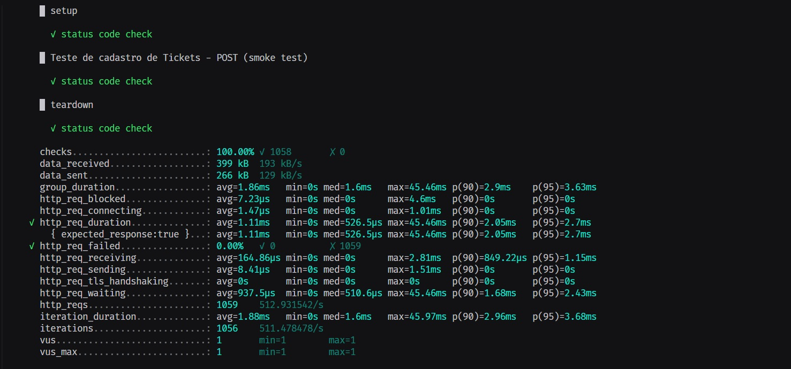

## Smoke test - GET

### Resultado

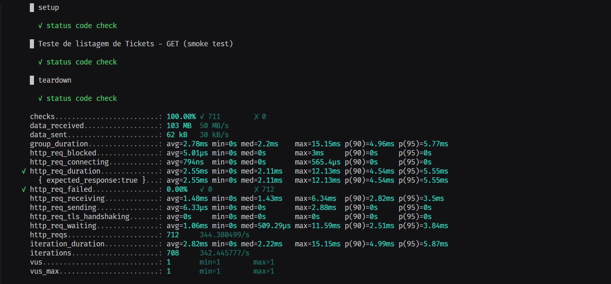

## Teste de Carga - POST

#### ✅ Teste aprovado

**Descrição:** Avaliar o desempenho do sistema sob carga normal esperada. \
**Configuração:** 150 usuários simultâneos, com dois ciclos de 2 min

### Resultado

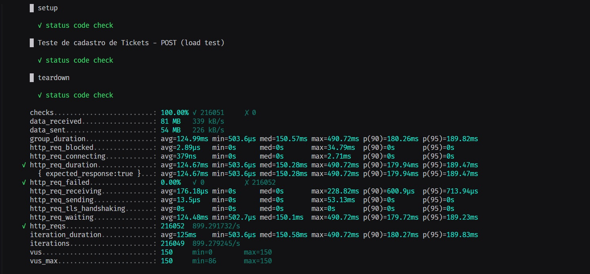

## Teste de Carga - GET

#### ✅ Teste aprovado

**Descrição:** Avaliar o desempenho do sistema sob carga normal esperada. \
**Configuração:** 150 usuários simultâneos, com dois ciclos de 2 min

### Resultado

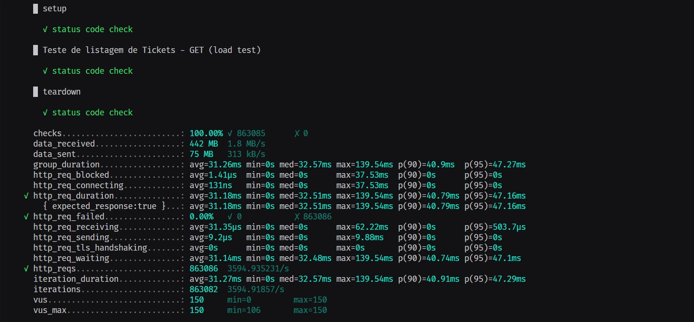

## Teste de Estresse - POST

#### ❌ Teste reprovado

**Descrição:** Identificar o ponto de falha do sistema ao submetê-lo a uma carga extrema. \
**Configuração:** 300 usuários simultâneos com requisições a cada 1 minuto, por 2 minutos

### Resultado

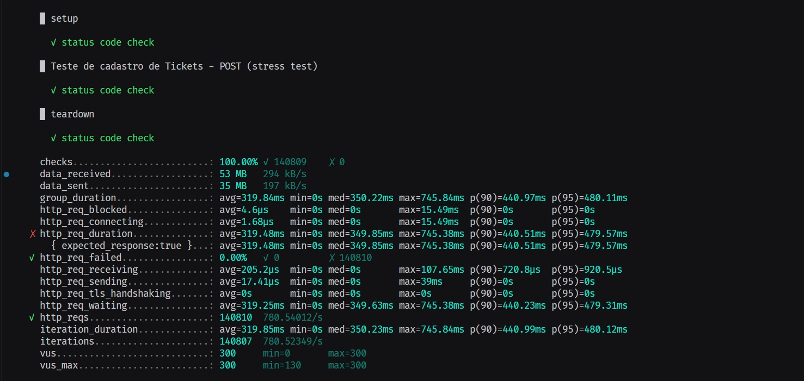

## Teste de Estresse - GET

#### ✅ Teste aprovado

**Descrição:** Identificar o ponto de falha do sistema ao submetê-lo a uma carga extrema. \
**Configuração:** 300 usuários simultâneos com requisições a cada 1 minuto, por 2 minutos

### Resultado

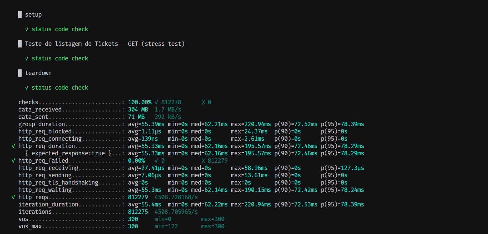

## Teste de Escalabilidade - POST

#### ❌ Teste reprovado

**Descrição:** Avaliar o comportamento do sistema sob diferentes configurações de infraestrutura.\
**Configuração:** 20% de usuários a mais do que no teste de estresse e mais 1 min.

### Resultado

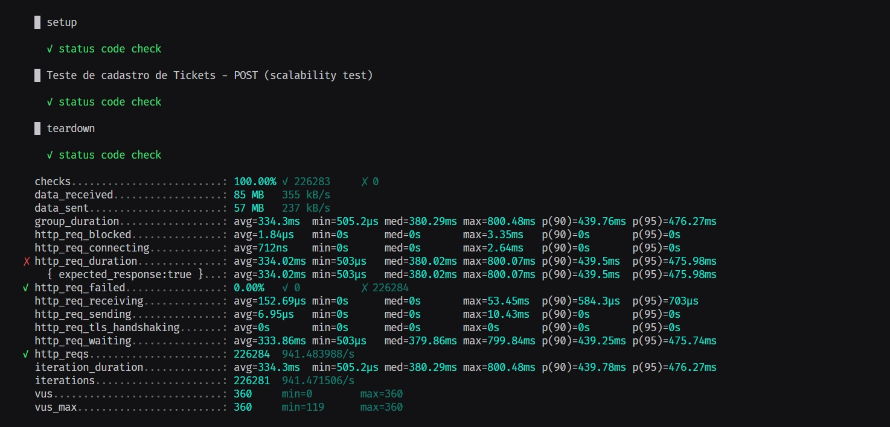

## Teste de Escalabilidade - GET

#### ✅ Teste aprovado

**Descrição:** Avaliar o comportamento do sistema sob diferentes configurações de infraestrutura.\
**Configuração:** 20% de usuários a mais do que no teste de estresse e mais 1 min.

### Resultado

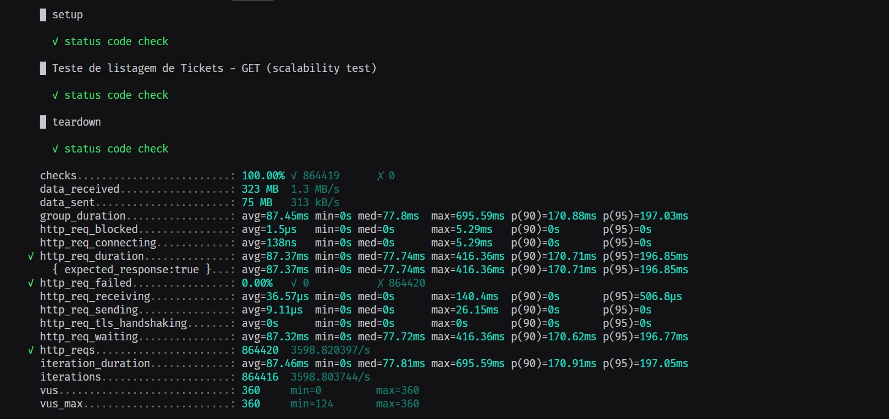

## Teste de Pico - POST

#### ❌ Teste reprovado

**Descrição:** Avaliar o comportamento do sistema sob um pico repentino de carga.\
**Configuração:** 700 usuários simultâneos por 2 min

### Resultado

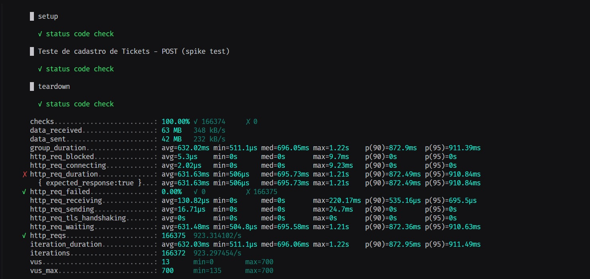

## Teste de Pico - GET

#### ✅ Teste aprovado

**Descrição:** Avaliar o comportamento do sistema sob um pico repentino de carga.\
**Configuração:** 700 usuários simultâneos por 2 min

### Resultado

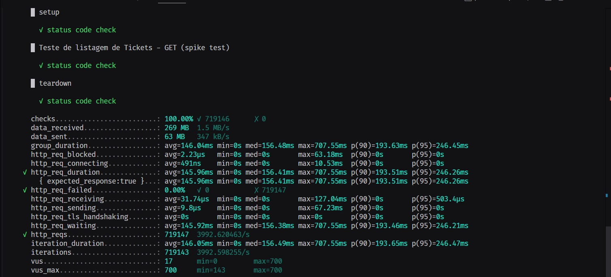

## Teste de Concorrência - POST

#### ❌ Teste reprovado

**Descrição:** Avaliar como o sistema lida com múltiplos usuários acessando simultaneamente\
**Configuração:** 500 usuários simultâneos por 1 min

### Resultados

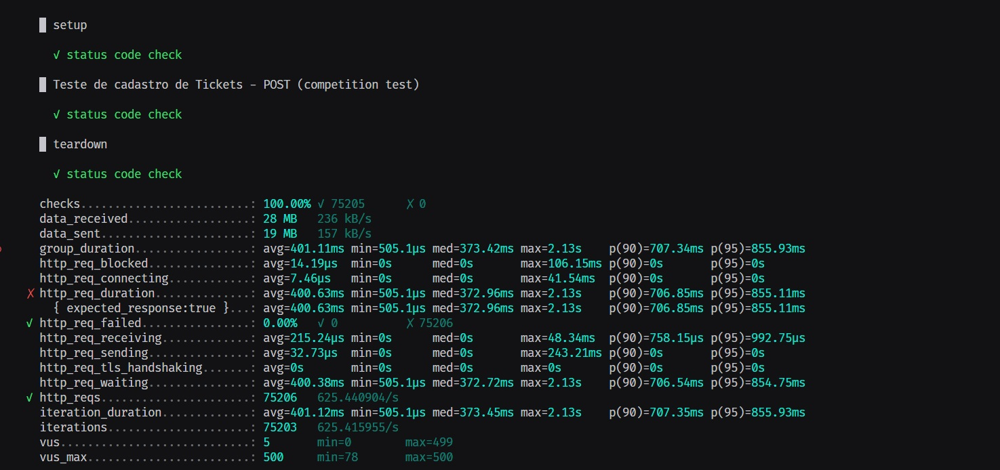

## Teste de Concorrência - GET

#### ❌ Teste reprovado

**Descrição:** Avaliar como o sistema lida com múltiplos usuários acessando simultaneamente\
**Configuração:** 500 usuários simultâneos por 1 min

### Resultados

